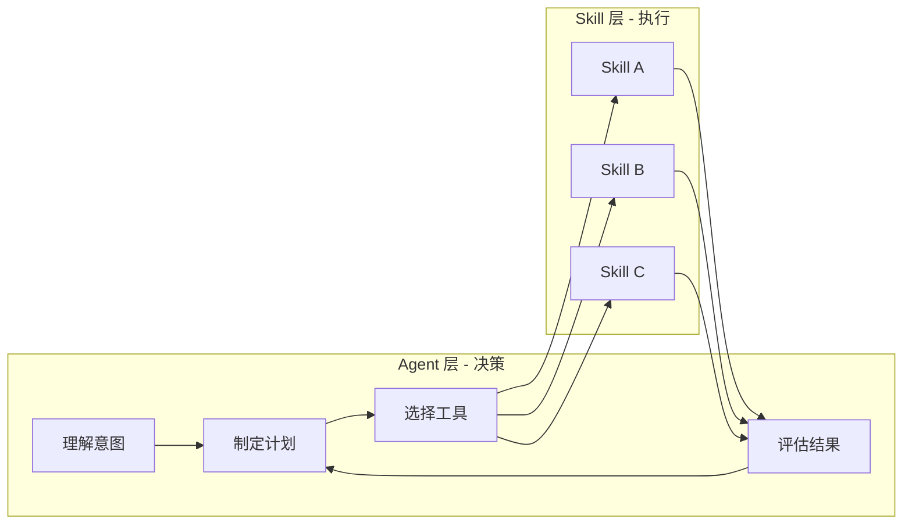
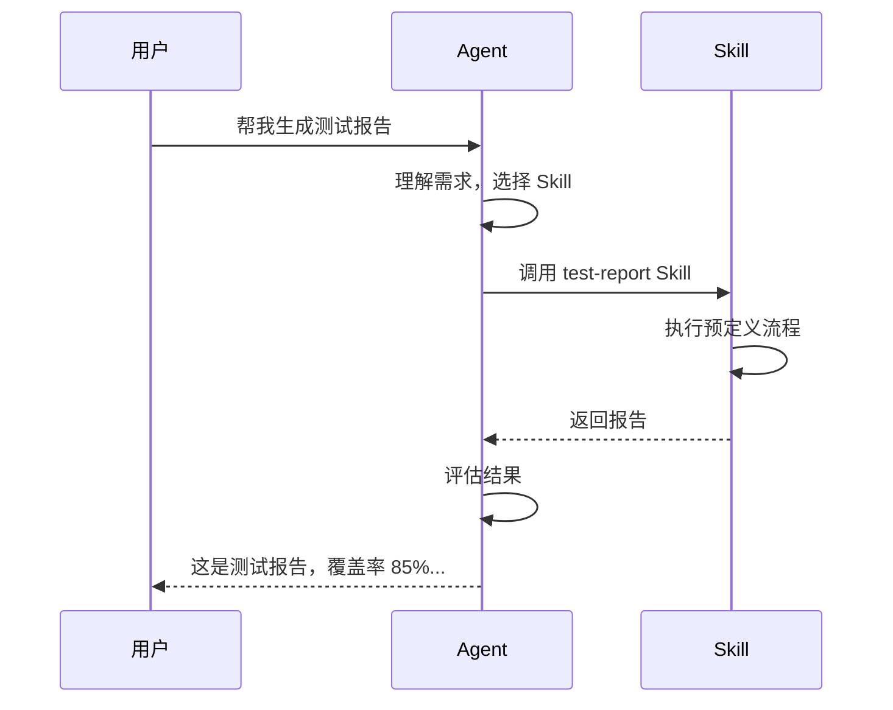
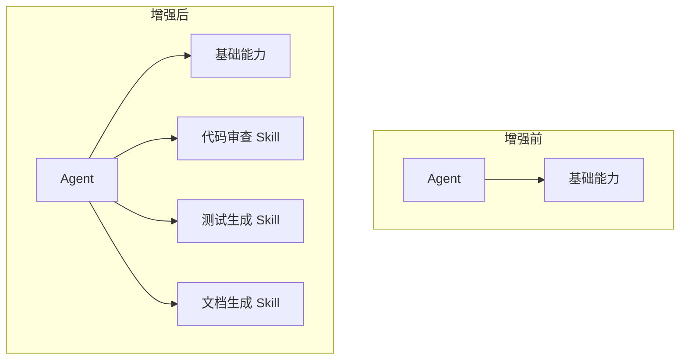
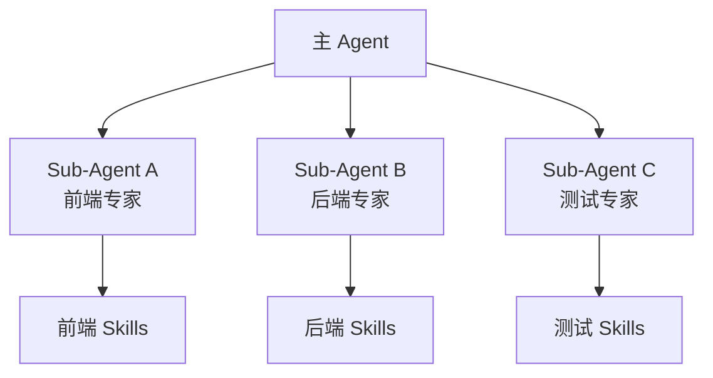
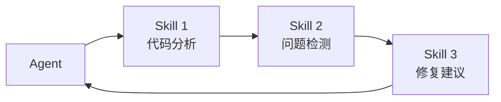
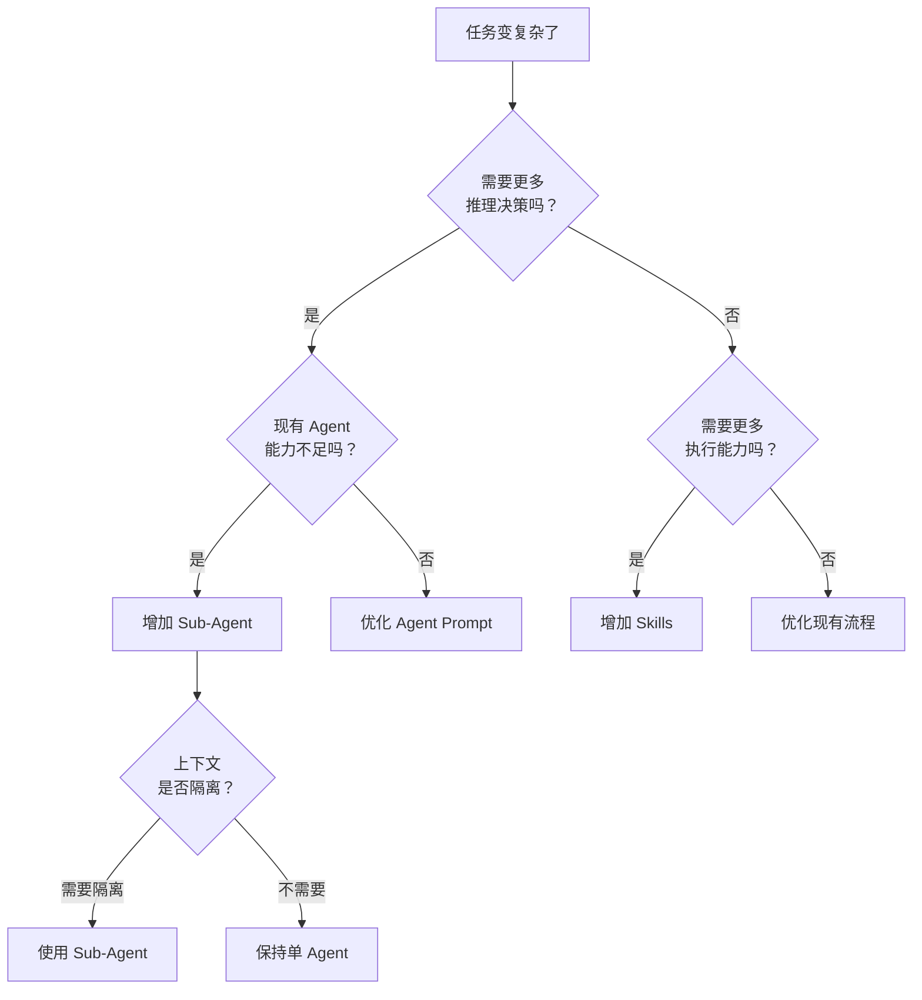

# Skills 与 Agent：深度比较指南

本文档深入探讨 Agent Skills 和 Agent（包括 Sub-Agent）之间的关系、边界和协作模式，帮助你理解何时该增强 Skills，何时该引入更多 Agent。

---

## 1. 核心概念回顾

### Agent：决策者

Agent 是具有**自主推理能力**的 AI 实体，能够：
- 理解意图并制定计划
- 选择合适的工具/技能
- 根据反馈调整行动
- 维护对话上下文

**类比**：项目经理 / 决策大脑

### Skills：执行者

Skills 是**模块化的能力包**，特点是：
- 被动等待调用
- 执行预定义的流程
- 无自主决策能力
- 可跨 Agent 复用

**类比**：工具箱 / 标准操作手册

---

## 2. 本质区别



| 维度 | Agent | Skills |
|------|-------|--------|
| **核心能力** | 推理、决策、规划 | 执行、输出、转换 |
| **自主性** | 高（可自主行动） | 无（被动调用） |
| **上下文** | 维护长期记忆 | 无状态/短期状态 |
| **灵活性** | 高（可应对新情况） | 低（按预设流程） |
| **可预测性** | 低（输出有变异） | 高（输出稳定） |
| **资源消耗** | 高（需要推理） | 低（直接执行） |
| **复用性** | 低（上下文绑定） | 高（跨场景复用） |

---

## 3. 能力边界分析

### Agent 擅长什么

```markdown
✅ 理解模糊的需求
   "帮我优化一下这个页面的性能" → Agent 分析、制定方案

✅ 处理未知情况
   遇到新问题时，Agent 可以推理出解决路径

✅ 多步骤协调
   需要根据中间结果动态调整后续步骤

✅ 上下文关联
   "继续刚才的工作" → Agent 知道"刚才"是什么

✅ 创造性任务
   设计新架构、提出新方案
```

### Agent 不擅长什么

```markdown
❌ 重复性执行
   每次都要重新推理相同的流程，浪费资源

❌ 精确格式输出
   推理过程可能导致输出格式不稳定

❌ 长流程记忆
   上下文窗口有限，长对话会"遗忘"

❌ 并行处理
   单 Agent 难以同时处理多个独立任务
```

### Skills 擅长什么

```markdown
✅ 标准化执行
   每次调用产出一致的结果

✅ 复杂工具链
   封装多步骤工具调用，Agent 只需一次调用

✅ 领域知识封装
   把专业知识编码成可执行流程

✅ 跨项目复用
   一次编写，多处使用

✅ 降低 Agent 负担
   减少 Agent 需要做的决策数量
```

### Skills 不擅长什么

```markdown
❌ 处理意外情况
   预设流程之外的情况无法处理

❌ 理解上下文
   不知道"之前"发生了什么

❌ 自主决策
   不能判断"是否应该"执行

❌ 动态调整
   流程固定，无法根据中间结果改变
```

---

## 4. 协作模式

### 模式一：Agent 调用 Skills（最常见）



**特点**：
- Agent 负责理解和决策
- Skill 负责执行
- Agent 可以对 Skill 输出进行二次处理

**适用场景**：大多数日常开发任务

### 模式二：Skills 增强 Agent 能力



**特点**：
- Skills 扩展 Agent 的能力边界
- Agent 获得"专家级"能力
- 不改变 Agent 本身

**适用场景**：需要专业领域能力时

### 模式三：Sub-Agent 分工协作



**特点**：
- 主 Agent 协调全局
- Sub-Agent 专注特定领域
- 每个 Sub-Agent 有自己的 Skills

**适用场景**：复杂的多领域任务

### 模式四：Skills 链式编排



**特点**：
- Skills 之间有固定的调用顺序
- Agent 只触发第一个 Skill
- 减少 Agent 的协调工作

**适用场景**：流水线式的处理流程

---

## 5. 取舍决策框架

### 问题一：该增强 Skills 还是增加 Agent？



### 问题二：何时用 Skill 替代 Agent 行为？

| 信号 | 建议 |
|------|------|
| Agent 每次都执行相同的步骤 | 封装成 Skill |
| Agent 输出格式不稳定 | 用 Skill 模板化输出 |
| Agent 经常"忘记"某些检查 | 用 Skill 强制执行检查 |
| Agent 推理时间过长 | 把确定性步骤移到 Skill |
| 多个项目需要相同能力 | 抽取为可复用 Skill |

### 问题三：何时用 Agent 替代 Skill？

| 信号 | 建议 |
|------|------|
| Skill 经常需要人工干预 | 让 Agent 处理异常 |
| Skill 流程分支过多 | 让 Agent 动态决策 |
| 需要理解上下文才能执行 | 让 Agent 提供上下文 |
| 输出需要根据情况调整 | 让 Agent 后处理 |

---

## 6. 性能与成本考量

### 资源消耗对比

```
任务执行成本 = Agent 推理成本 + Skill 执行成本

┌─────────────────────────────────────────────────────┐
│ 纯 Agent 方案                                        │
│ ████████████████████████████████ 推理成本高          │
│ ░░░░ 执行成本低                                      │
│ 总成本：高，但灵活                                    │
├─────────────────────────────────────────────────────┤
│ Agent + Skills 方案                                  │
│ ████████ 推理成本中                                  │
│ ████████ 执行成本中                                  │
│ 总成本：中，平衡                                      │
├─────────────────────────────────────────────────────┤
│ 重 Skills 方案                                       │
│ ████ 推理成本低                                      │
│ ████████████████ 执行成本高                          │
│ 总成本：低，但不灵活                                  │
└─────────────────────────────────────────────────────┘
```

### 响应时间对比

| 方案 | 首次响应 | 重复任务 | 复杂任务 |
|------|---------|---------|---------|
| 纯 Agent | 慢 | 慢 | 中 |
| Agent + Skills | 中 | 快 | 中 |
| 重 Skills | 快 | 快 | 慢（需人工） |

### 成本优化建议

```markdown
1. 识别高频任务
   - 统计哪些任务执行最频繁
   - 优先将这些任务 Skill 化

2. 分析推理开销
   - 如果 Agent 花大量时间在"想"而不是"做"
   - 考虑预定义更多决策路径

3. 缓存 Skill 结果
   - 相同输入 → 相同输出的 Skill
   - 可以缓存结果避免重复执行

4. 分层处理
   - 简单任务：直接 Skill
   - 中等任务：Agent + Skills
   - 复杂任务：多 Agent + Skills
```

---

## 7. 实践案例

### 案例一：代码审查

**初始方案：纯 Agent**

```markdown
问题：
- Agent 每次都要重新理解审查标准
- 输出格式不一致
- 容易遗漏某些检查项
```

**优化方案：Agent + Skills**

```markdown
code-review/
├── SKILL.md
├── scripts/
│   ├── lint-check.sh
│   ├── security-scan.sh
│   └── style-check.sh
└── references/
    └── review-checklist.md

流程：
1. Agent 理解 PR 的目的和上下文
2. 调用 code-review Skill 执行标准检查
3. Agent 综合 Skill 输出，给出人性化建议
```

**效果**：
- 检查项覆盖率：60% → 95%
- 输出一致性：提升
- 审查时间：减少 40%

### 案例二：全栈开发

**初始方案：单 Agent**

```markdown
问题：
- 上下文过长，Agent "遗忘"之前的决策
- 前后端逻辑混淆
- 难以并行开发
```

**优化方案：多 Sub-Agent + Skills**

```markdown
架构：
┌─────────────────────────────────────┐
│           主 Agent (协调者)          │
├─────────────────────────────────────┤
│  ┌─────────┐  ┌─────────┐  ┌─────────┐
│  │前端Agent│  │后端Agent│  │测试Agent│
│  └────┬────┘  └────┬────┘  └────┬────┘
│       │            │            │
│  ┌────┴────┐  ┌────┴────┐  ┌────┴────┐
│  │前端Skills│  │后端Skills│  │测试Skills│
│  └─────────┘  └─────────┘  └─────────┘
└─────────────────────────────────────┘

流程：
1. 主 Agent 理解需求，拆分任务
2. 前端 Agent 处理 UI，调用前端 Skills
3. 后端 Agent 处理 API，调用后端 Skills
4. 测试 Agent 生成测试，调用测试 Skills
5. 主 Agent 整合结果
```

**效果**：
- 上下文隔离，不再混淆
- 可并行处理，效率提升
- 各领域专业度提升

### 案例三：文档生成

**初始方案：复杂 Skill**

```markdown
问题：
- Skill 流程过于复杂，难以维护
- 无法处理特殊情况
- 输出过于机械
```

**优化方案：Agent 主导 + 轻量 Skills**

```markdown
流程：
1. Agent 分析代码结构（推理）
2. 调用 extract-api Skill（执行）
3. Agent 组织文档结构（推理）
4. 调用 format-markdown Skill（执行）
5. Agent 润色和补充说明（推理）
```

**效果**：
- 文档质量提升（有 Agent 润色）
- 格式稳定（有 Skill 保证）
- 可处理特殊情况（Agent 灵活应对）

---

## 8. 常见误区

### 误区一：Skills 越多越好

**问题**：Agent 面对太多 Skills 时会"选择困难"

**解决**：
- 控制 Skills 数量（建议 <20 个常用）
- 按领域分组，让 Agent 先选领域
- 合并功能相近的 Skills

### 误区二：Agent 可以替代一切

**问题**：让 Agent 做所有事情，效率低下

**解决**：
- 识别确定性任务，交给 Skills
- Agent 专注于需要判断的环节
- 建立 Agent + Skills 的分工边界

### 误区三：Sub-Agent 解决一切复杂问题

**问题**：过早引入多 Agent，增加复杂度

**解决**：
- 先尝试优化单 Agent + Skills
- 只有当上下文隔离是必须时才引入 Sub-Agent
- 从 2 个 Agent 开始，逐步增加

### 误区四：Skills 不需要 Agent 理解

**问题**：Skills 设计不考虑 Agent 如何调用

**解决**：
- SKILL.md 要写清楚"何时调用"
- 提供清晰的输入输出说明
- 给出调用示例

---

## 9. 设计原则

### 原则一：单一职责

```markdown
✅ 好的设计：
   - Skill A：代码格式化
   - Skill B：代码检查
   - Skill C：代码修复

❌ 不好的设计：
   - Skill X：代码格式化+检查+修复（职责过多）
```

### 原则二：清晰边界

```markdown
Agent 负责：
- 理解用户意图
- 选择执行路径
- 处理异常情况
- 综合多个结果

Skills 负责：
- 执行具体操作
- 保证输出格式
- 封装工具调用
- 提供领域能力
```

### 原则三：渐进增强

```markdown
演进路径：

阶段 1：单 Agent
        ↓ 遇到重复任务
阶段 2：Agent + 基础 Skills
        ↓ 任务变复杂
阶段 3：Agent + 丰富 Skills
        ↓ 上下文过载
阶段 4：多 Agent + Skills
```

### 原则四：可观测性

```markdown
确保你能回答：
- Agent 调用了哪些 Skills？
- 每个 Skill 的输入输出是什么？
- Agent 的决策依据是什么？
- 哪个环节出了问题？
```

---

## 10. 总结

### 核心观点

```
Agent 是大脑，Skills 是双手。
大脑负责思考，双手负责执行。
好的协作是：大脑不做双手的事，双手不做大脑的事。
```

### 快速决策表

| 你的情况 | 建议 |
|---------|------|
| 任务简单且重复 | 用 Skill |
| 任务复杂且多变 | 用 Agent |
| 任务复杂但流程固定 | Agent + Skills |
| 需要多领域协作 | 多 Agent + Skills |
| Agent 经常出错 | 增加 Skills 约束 |
| Skills 无法处理特殊情况 | 让 Agent 介入 |

### 最佳实践清单

```markdown
□ Agent 和 Skills 职责清晰分离
□ Skills 数量适中，避免选择困难
□ 高频任务优先 Skill 化
□ 保留 Agent 处理异常的能力
□ Sub-Agent 按需引入，不过早优化
□ 定期评估 Agent-Skills 协作效率
□ 保持可观测性，便于调试
```
