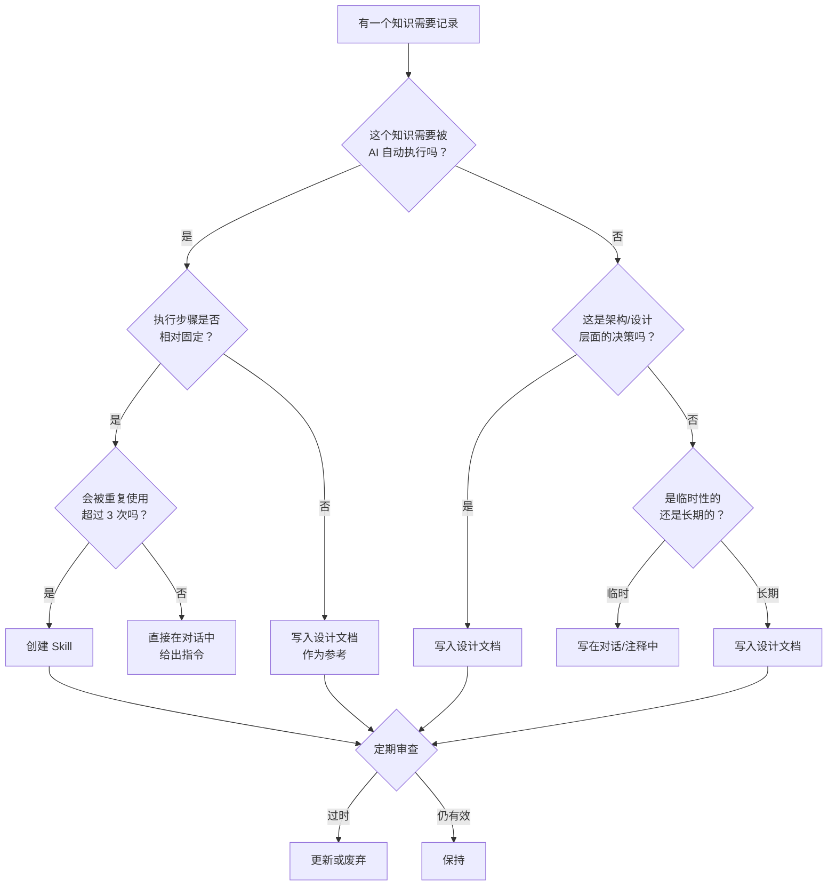

# Skills 与设计文档：深度取舍指南

本文档专门探讨 Agent Skills 和设计文档这两种知识载体的取舍、维护策略和最佳实践。

---

## 1. 本质区别

### Skills：可执行的知识

Skills 是**面向 AI Agent 的可执行知识包**，核心特点是"可被调用"。

```
skill-folder/
├── SKILL.md          # 技能说明书（AI 读取的入口）
├── scripts/          # 可执行脚本
├── references/       # 参考资料
└── templates/        # 模板文件
```

**本质**：把"怎么做"编码成可重复执行的流程

### 设计文档：静态的知识

设计文档是**面向人类和 AI 的静态参考**，核心特点是"可被阅读"。

```
design-doc.md
├── 背景与目标
├── 架构设计
├── 接口规范
├── 约束条件
└── 决策记录
```

**本质**：把"是什么"和"为什么"记录成可追溯的文字

---

## 2. 核心差异对比

| 维度 | Skills | 设计文档 |
|------|--------|---------|
| **主要受众** | AI Agent | 人类 + AI |
| **内容形式** | 指令式、步骤化 | 描述式、解释性 |
| **执行能力** | 可直接触发动作 | 仅供参考，不能执行 |
| **更新频率** | 随工作流优化而迭代 | 随需求/架构变更而更新 |
| **粒度** | 细粒度（单一任务） | 粗粒度（系统/模块级） |
| **生命周期** | 可能频繁废弃/替换 | 长期存在，持续演进 |
| **复用范围** | 跨项目、跨会话 | 通常项目内部 |

---

## 3. 何时选择 Skills

### 适合场景

**1. 重复性工作流**

当某个任务需要反复执行且步骤固定时，应该封装为 Skill。

```markdown
# 示例：代码审查 Skill
- 每次 PR 都需要检查相同的规范
- 检查步骤固定：lint → test → security scan → style check
- 输出格式统一
```

**2. 需要标准化输出**

当你希望 AI 每次都产出一致格式的结果时。

```markdown
# 示例：测试报告生成 Skill
- 固定的报告模板
- 统一的数据收集方式
- 标准化的输出格式
```

**3. 涉及工具调用链**

当任务需要调用多个工具按特定顺序执行时。

```markdown
# 示例：部署检查 Skill
1. 运行单元测试
2. 检查依赖版本
3. 验证环境变量
4. 生成变更日志
```

**4. 团队共享的最佳实践**

当某个做法被验证有效，需要在团队中推广时。

### 不适合场景

- 一次性任务（创建 Skill 的成本 > 直接做的成本）
- 高度定制化的需求（每次都不一样）
- 需要大量人类判断的任务
- 快速变化的领域（Skill 会很快过时）

---

## 4. 何时选择设计文档

### 适合场景

**1. 架构决策记录**

```markdown
# 示例：为什么选择 PostgreSQL 而不是 MongoDB
- 背景：需要复杂的关联查询
- 决策：选择 PostgreSQL
- 理由：ACID 保证、成熟的 ORM 支持
- 后果：需要维护 schema migration
```

**2. 接口契约定义**

```markdown
# 示例：API 接口规范
- 端点定义
- 请求/响应格式
- 错误码约定
- 版本策略
```

**3. 系统边界说明**

```markdown
# 示例：模块职责划分
- 模块 A 负责用户认证
- 模块 B 负责订单处理
- 模块间通过消息队列通信
```

**4. 约束条件记录**

```markdown
# 示例：性能要求
- 响应时间 < 200ms
- 并发支持 1000 QPS
- 数据保留 90 天
```

### 不适合场景

- 纯执行性的操作步骤（应该用 Skill）
- 临时性的沟通内容
- 频繁变化的实现细节

---

## 5. 取舍决策流程图



---

## 6. 结合使用模式

### 模式一：设计文档驱动 Skill

**流程**：先写设计文档 → 基于文档创建 Skill

```
1. 设计文档定义"做什么"和"为什么"
2. Skill 实现"怎么做"
3. Skill 引用设计文档作为 reference
```

**示例结构**：

```
project/
├── docs/
│   └── api-design.md              # 设计文档：API 规范
└── skills/
    └── api-validator/
        ├── SKILL.md               # 技能：验证 API 实现是否符合规范
        └── references/
            └── api-design.md      # 链接到设计文档
```

**适用场景**：规范性强的项目、团队协作项目

### 模式二：Skill 沉淀设计文档

**流程**：先用 Skill 执行 → 沉淀经验到设计文档

```
1. Skill 在实践中验证有效
2. 提取 Skill 中的决策逻辑
3. 写入设计文档作为团队知识
```

**适用场景**：探索性项目、快速迭代阶段

### 模式三：并行维护

**流程**：设计文档和 Skill 各司其职，互相引用

```
设计文档                          Skill
    │                              │
    ├── 定义架构约束 ──────────────→ 引用约束进行检查
    │                              │
    ←────────────────────────────── 执行结果反馈更新
```

**适用场景**：成熟项目、长期维护项目

---

## 7. 维护策略

### Skills 的维护

| 维护动作 | 触发条件 | 具体做法 |
|---------|---------|---------|
| **更新** | 工作流变化、工具升级 | 修改 SKILL.md 和相关脚本 |
| **废弃** | 不再使用、被更好的 Skill 替代 | 标记 deprecated 或删除 |
| **拆分** | Skill 变得过于复杂 | 拆成多个单一职责的 Skill |
| **合并** | 多个 Skill 高度相关 | 合并为一个，减少维护成本 |

**维护检查清单**：

```markdown
□ Skill 最近 30 天是否被使用过？
□ Skill 的输出是否仍然符合预期？
□ Skill 依赖的工具/API 是否有变化？
□ Skill 的文档是否与实际行为一致？
```

### 设计文档的维护

| 维护动作 | 触发条件 | 具体做法 |
|---------|---------|---------|
| **更新** | 需求变更、架构调整 | 修改相关章节，记录变更历史 |
| **归档** | 项目结束、功能下线 | 移到 archive 目录 |
| **拆分** | 文档过长（>50页） | 按模块拆分 |
| **关联** | 新增相关文档 | 添加交叉引用链接 |

**维护检查清单**：

```markdown
□ 文档描述是否与当前代码一致？
□ 接口定义是否是最新的？
□ 决策记录是否包含最近的重要决策？
□ 是否有过时的章节需要更新或删除？
```

---

## 8. 常见陷阱与解决方案

### 陷阱一：Skill 与文档脱节

**症状**：Skill 执行的逻辑与设计文档描述不一致

**解决方案**：
- 在 Skill 中显式引用设计文档
- 设置定期同步检查（如每月一次）
- 使用版本号关联（Skill v1.2 对应 Doc v1.2）

### 陷阱二：过度 Skill 化

**症状**：为每个小任务都创建 Skill，导致 Skill 泛滥

**解决方案**：
- 设立创建 Skill 的门槛（如：预计使用 >3 次）
- 定期清理不活跃的 Skill
- 优先复用现有 Skill 而非创建新的

### 陷阱三：设计文档过于详细

**症状**：文档包含大量实现细节，难以维护

**解决方案**：
- 设计文档只记录"什么"和"为什么"
- 实现细节放在代码注释或 Skill 中
- 保持文档的抽象层级一致

### 陷阱四：忽视维护

**症状**：Skill 和文档都过时，AI 产出质量下降

**解决方案**：
- 设立维护责任人
- 在 CI/CD 中加入文档检查
- 将维护工作纳入迭代计划

---

## 9. 实践建议

### 对于个人开发者

```markdown
1. 从设计文档开始
   - 先写清楚你要做什么
   - 这个过程本身帮助你理清思路

2. 识别重复模式
   - 当你发现自己反复给 AI 相同的指令
   - 这就是创建 Skill 的信号

3. 保持轻量
   - 不需要完美的文档结构
   - 能用就行，逐步完善
```

### 对于团队

```markdown
1. 建立共享的 Skills 库
   - 团队成员可以贡献和复用
   - 设立 review 机制保证质量

2. 设计文档模板化
   - 统一的文档结构
   - 降低编写和阅读成本

3. 定期 Review
   - 每个迭代 review 一次 Skills 有效性
   - 每季度 review 一次设计文档准确性
```

### 推荐的目录结构

```
project/
├── docs/
│   ├── architecture/           # 架构设计文档
│   │   ├── overview.md
│   │   └── decisions/          # ADR (Architecture Decision Records)
│   ├── api/                    # API 规范文档
│   └── guides/                 # 开发指南
├── skills/
│   ├── code-review/            # 代码审查 Skill
│   ├── test-generation/        # 测试生成 Skill
│   └── deployment-check/       # 部署检查 Skill
└── .cursor/
    └── rules/                  # Cursor 规则（轻量级指令）
```

---

## 10. 总结

### 一句话原则

> **设计文档回答"是什么"和"为什么"，Skills 回答"怎么做"。**

### 取舍速查表

| 你的需求 | 选择 |
|---------|------|
| 记录架构决策 | 设计文档 |
| 自动化重复任务 | Skill |
| 定义接口规范 | 设计文档 |
| 标准化输出格式 | Skill |
| 解释为什么这样设计 | 设计文档 |
| 让 AI 按固定流程执行 | Skill |
| 团队知识沉淀 | 两者结合 |

### 最终建议

1. **不要二选一**：它们是互补的，不是替代关系
2. **从文档开始**：先想清楚再动手，文档是思考的载体
3. **用 Skill 提效**：把验证有效的流程封装起来
4. **持续维护**：过时的知识比没有知识更危险
