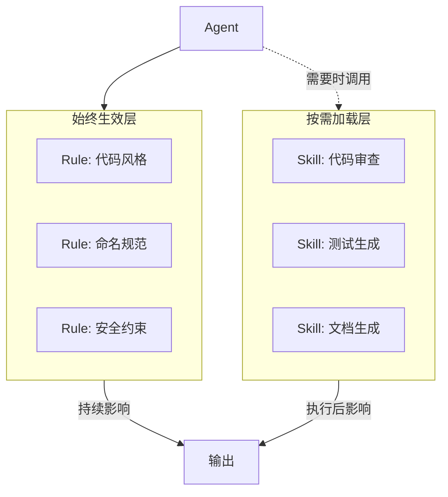
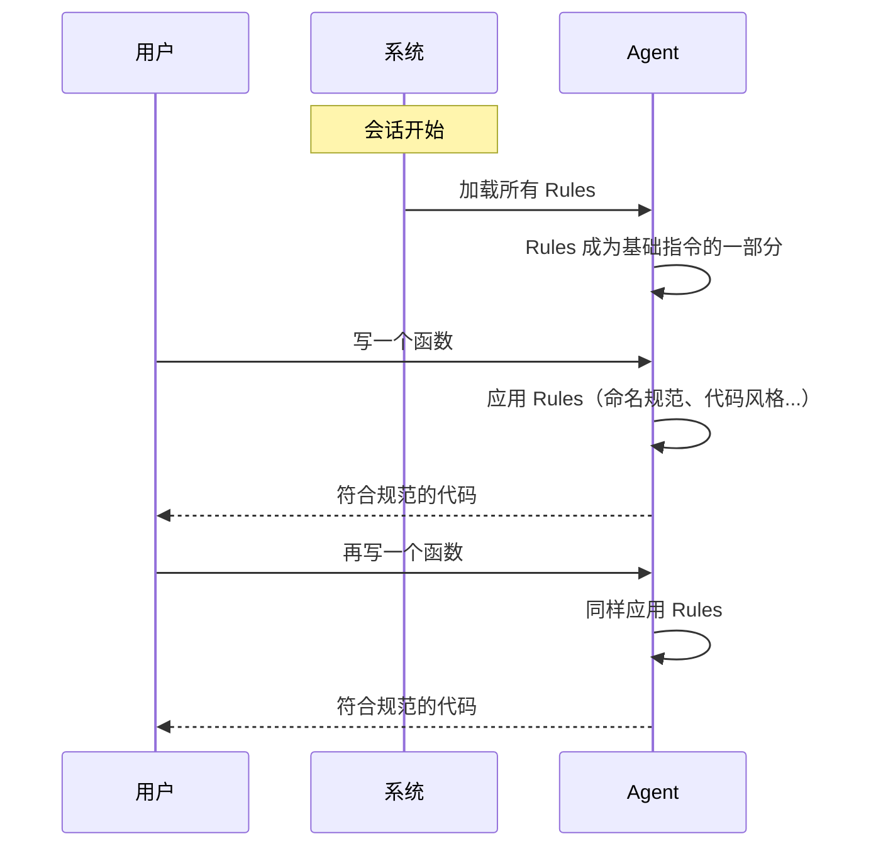
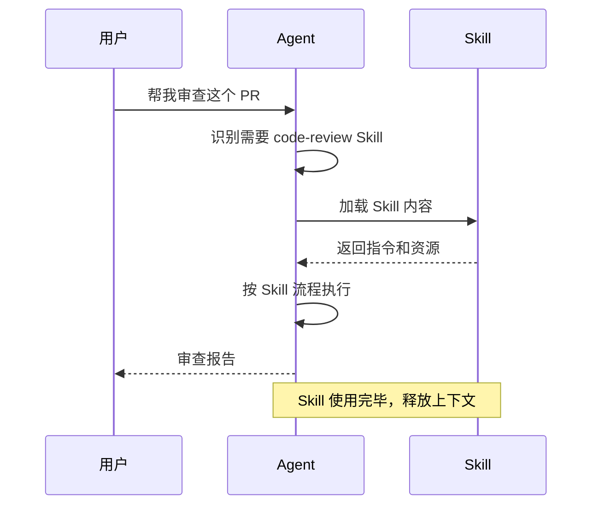
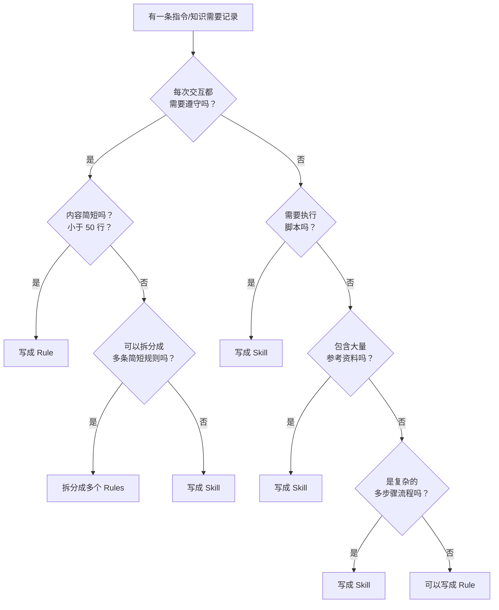
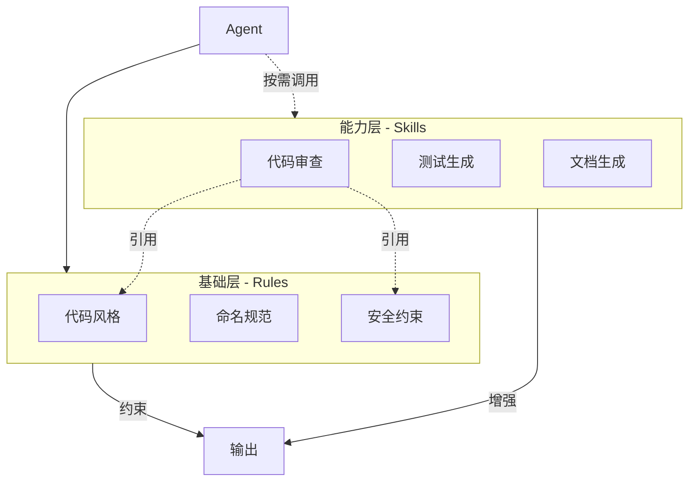

# Skills 与 Rules：深度比较指南

本文档深入探讨 Agent Skills 和 Rules（规则文件）之间的区别、适用场景和协作方式，帮助你理解何时该创建 Skill，何时该编写 Rule。

---

## 1. 核心概念

### Skills：按需加载的能力包

Skills 是**模块化的、可被 Agent 主动调用的能力集合**。

```
skill-folder/
├── SKILL.md          # 技能入口（描述何时/如何使用）
├── scripts/          # 可执行脚本
├── references/       # 参考资料
└── templates/        # 模板文件
```

**核心特点**：
- 按需加载，不占用基础上下文
- Agent 主动发现和调用
- 包含可执行的脚本和资源
- 适合复杂的、多步骤的任务

### Rules：始终生效的行为准则

Rules 是**持久化的、始终影响 Agent 行为的指令集**。

```
.cursor/rules/
├── code-style.mdc        # 代码风格规则
├── naming-convention.mdc # 命名规范
└── security.mdc          # 安全规则

# 或者
AGENTS.md                 # 仓库级规则
```

**核心特点**：
- 始终加载，持续影响行为
- 被动生效，无需显式调用
- 纯文本指令，无可执行脚本
- 适合简单的、持续性的约束

---

## 2. 本质区别



### 对比表

| 维度 | Skills | Rules |
|------|--------|-------|
| **加载方式** | 按需加载 | 始终加载 |
| **触发方式** | Agent 主动调用 | 自动生效 |
| **内容形式** | 指令 + 脚本 + 资源 | 纯文本指令 |
| **上下文占用** | 调用时才占用 | 始终占用 |
| **复杂度** | 可以很复杂 | 应保持简单 |
| **作用范围** | 特定任务 | 所有任务 |
| **执行能力** | 可执行脚本 | 无执行能力 |
| **维护位置** | `skills/` 目录 | `.cursor/rules/` 或 `AGENTS.md` |

---

## 3. 工作机制对比

### Rules 的工作机制



**特点**：
- Rules 在会话开始时加载
- 每次交互都自动应用
- 用户无需提及，Agent 自动遵守

### Skills 的工作机制



**特点**：
- Skills 在需要时才加载
- Agent 主动识别和调用
- 使用完毕后释放上下文

---

## 4. 适用场景分析

### 何时使用 Rules

**1. 代码风格约束**

```markdown
# .cursor/rules/code-style.mdc

## 代码风格规则

- 使用 2 空格缩进
- 字符串使用单引号
- 函数名使用 camelCase
- 常量使用 UPPER_SNAKE_CASE
- 每个文件末尾保留一个空行
```

**为什么用 Rule**：每次写代码都需要遵守，应该始终生效

**2. 项目约定**

```markdown
# AGENTS.md

## 项目约定

- 本项目使用 TypeScript，不使用 JavaScript
- API 响应统一使用 { data, error, message } 格式
- 所有异步函数必须有错误处理
```

**为什么用 Rule**：这是项目级的约定，所有操作都应遵守

**3. 安全规范**

```markdown
# .cursor/rules/security.mdc

## 安全规范

- 永远不要在代码中硬编码密钥或密码
- 所有用户输入必须验证和转义
- 敏感数据必须加密存储
- 不要在日志中输出敏感信息
```

**为什么用 Rule**：安全是底线，必须始终遵守

**4. 沟通偏好**

```markdown
# .cursor/rules/communication.mdc

## 沟通偏好

- 使用中文回复
- 代码注释使用英文
- 解释技术概念时给出类比
```

**为什么用 Rule**：这是持续性的偏好设置

### 何时使用 Skills

**1. 复杂的工作流程**

```markdown
# skills/code-review/SKILL.md

## 代码审查技能

### 触发条件
当用户要求审查代码、PR 或提交时使用

### 执行步骤
1. 运行 lint 检查
2. 运行安全扫描
3. 检查测试覆盖率
4. 分析代码复杂度
5. 生成审查报告
```

**为什么用 Skill**：这是一个多步骤的复杂流程，不是每次都需要

**2. 需要执行脚本**

```markdown
# skills/test-report/SKILL.md

## 测试报告生成

### 脚本
- scripts/run-tests.sh：执行测试
- scripts/collect-coverage.sh：收集覆盖率
- scripts/generate-report.py：生成报告
```

**为什么用 Skill**：Rules 不能执行脚本，只有 Skills 可以

**3. 包含大量参考资料**

```markdown
# skills/api-design/SKILL.md

## API 设计技能

### 参考资料
- references/rest-best-practices.md (50页)
- references/error-code-standards.md (20页)
- references/versioning-guide.md (15页)
```

**为什么用 Skill**：大量资料不应始终占用上下文，按需加载更高效

**4. 特定领域的专业任务**

```markdown
# skills/performance-audit/SKILL.md

## 性能审计技能

### 触发条件
当用户要求分析性能、优化速度时使用

### 专业知识
- 性能指标定义
- 分析工具使用
- 优化策略库
```

**为什么用 Skill**：这是专业领域任务，不是日常都需要

---

## 5. 取舍决策流程



### 快速判断清单

| 问题 | 是 → | 否 → |
|------|------|------|
| 每次都需要遵守？ | Rule | Skill |
| 需要执行脚本？ | Skill | 继续判断 |
| 内容超过 50 行？ | Skill | Rule |
| 包含大量参考资料？ | Skill | Rule |
| 是多步骤流程？ | Skill | Rule |
| 是特定任务才需要？ | Skill | Rule |

---

## 6. 协作模式

### 模式一：Rules 定义标准，Skills 执行检查

```
Rules（定义）          Skills（执行）
     │                      │
     ▼                      ▼
┌─────────────┐      ┌─────────────┐
│ 代码风格标准 │ ───→ │ 代码审查技能 │
│ (始终遵守)   │      │ (检查是否遵守)│
└─────────────┘      └─────────────┘
```

**示例**：

```markdown
# Rule: code-style.mdc
- 函数不超过 50 行
- 圈复杂度不超过 10

# Skill: code-review/SKILL.md
执行检查：
1. 扫描所有函数，检查行数
2. 计算圈复杂度
3. 报告违规项
```

### 模式二：Rules 约束行为，Skills 提供能力

```
┌─────────────────────────────────────┐
│              Agent                   │
│  ┌─────────────────────────────┐    │
│  │     Rules (行为边界)         │    │
│  │  - 不能删除生产数据          │    │
│  │  - 必须有错误处理            │    │
│  └─────────────────────────────┘    │
│                 │                    │
│                 ▼                    │
│  ┌─────────────────────────────┐    │
│  │     Skills (能力扩展)        │    │
│  │  - 数据库迁移技能            │    │
│  │  - 错误处理生成技能          │    │
│  └─────────────────────────────┘    │
└─────────────────────────────────────┘
```

**关系**：Rules 是"不能做什么"，Skills 是"能做什么"

### 模式三：分层配置

```
┌─────────────────────────────────────┐
│  全局 Rules（所有项目通用）          │
│  - 基本代码风格                      │
│  - 通用安全规范                      │
├─────────────────────────────────────┤
│  项目 Rules（本项目特有）            │
│  - 项目技术栈约定                    │
│  - 项目命名规范                      │
├─────────────────────────────────────┤
│  通用 Skills（跨项目复用）           │
│  - 代码审查                          │
│  - 测试生成                          │
├─────────────────────────────────────┤
│  项目 Skills（本项目特有）           │
│  - 特定业务流程                      │
│  - 项目部署流程                      │
└─────────────────────────────────────┘
```

---

## 7. 上下文管理

### Rules 的上下文影响

```
会话上下文容量：100%
┌────────────────────────────────────────────┐
│████████░░░░░░░░░░░░░░░░░░░░░░░░░░░░░░░░░░░░│
│  Rules    可用空间                          │
│  (20%)    (80%)                             │
└────────────────────────────────────────────┘

Rules 越多，可用空间越少
```

**建议**：
- 保持 Rules 简洁（总量 < 2000 tokens）
- 避免在 Rules 中放大段参考资料
- 定期清理不再需要的 Rules

### Skills 的上下文影响

```
未调用 Skill 时：
┌────────────────────────────────────────────┐
│████████░░░░░░░░░░░░░░░░░░░░░░░░░░░░░░░░░░░░│
│  Rules    可用空间                          │
│  (20%)    (80%)                             │
└────────────────────────────────────────────┘

调用 Skill 时：
┌────────────────────────────────────────────┐
│████████████████████░░░░░░░░░░░░░░░░░░░░░░░░│
│  Rules    Skill     可用空间                │
│  (20%)    (30%)     (50%)                   │
└────────────────────────────────────────────┘

Skill 执行完毕后：
┌────────────────────────────────────────────┐
│████████░░░░░░░░░░░░░░░░░░░░░░░░░░░░░░░░░░░░│
│  Rules    可用空间（恢复）                   │
│  (20%)    (80%)                             │
└────────────────────────────────────────────┘
```

**优势**：Skills 按需占用，用完释放

---

## 8. 维护策略

### Rules 的维护

| 维护动作 | 触发条件 | 注意事项 |
|---------|---------|---------|
| **新增** | 发现需要持续遵守的约定 | 确认是否真的"每次都需要" |
| **修改** | 标准变化、发现问题 | 通知团队，可能影响所有输出 |
| **删除** | 不再适用、过于严格 | 确认没有依赖此规则的流程 |
| **拆分** | 单条规则过长 | 按主题拆分成多个文件 |

**维护检查清单**：

```markdown
□ 每条 Rule 是否仍然适用？
□ Rules 总量是否过大（>2000 tokens）？
□ 是否有重复或冲突的 Rules？
□ 是否有应该移到 Skill 的内容？
```

### Skills 的维护

| 维护动作 | 触发条件 | 注意事项 |
|---------|---------|---------|
| **新增** | 识别到重复的复杂任务 | 确认使用频率足够高 |
| **更新** | 流程变化、工具升级 | 测试更新后的 Skill |
| **废弃** | 不再使用 | 可以保留但标记 deprecated |
| **优化** | 执行效率低 | 精简步骤、优化脚本 |

**维护检查清单**：

```markdown
□ Skill 最近是否被使用？
□ Skill 的脚本是否仍能正常执行？
□ Skill 的参考资料是否过时？
□ 是否有可以合并的相似 Skills？
```

---

## 9. 常见误区

### 误区一：把复杂流程写成 Rule

**问题**：

```markdown
# 错误示例：code-style.mdc

## 代码审查流程（不应该在这里）

1. 首先运行 lint 检查...
2. 然后执行安全扫描...
3. 接着检查测试覆盖率...
（50+ 行的详细流程）
```

**后果**：
- 占用大量上下文
- 每次交互都加载，即使不需要审查

**解决**：把复杂流程移到 Skill

### 误区二：把简单约定写成 Skill

**问题**：

```markdown
# 错误示例：skills/naming/SKILL.md

## 命名规范技能

### 规则
- 变量用 camelCase
- 常量用 UPPER_CASE
```

**后果**：
- 需要显式调用才生效
- 容易忘记调用
- 增加不必要的复杂度

**解决**：简单约定直接写成 Rule

### 误区三：Rules 和 Skills 内容重复

**问题**：

```markdown
# Rule 中写了
- 函数不超过 50 行

# Skill 中又写了
- 检查函数是否超过 50 行
```

**后果**：
- 维护两份相同内容
- 容易不一致

**解决**：
- Rule 定义标准
- Skill 引用 Rule，只写执行逻辑

### 误区四：过度依赖 Rules

**问题**：把所有知识都写成 Rules

**后果**：
- 上下文被大量占用
- Agent 响应变慢
- 信息过载，反而降低效果

**解决**：
- Rules 只放必须始终遵守的内容
- 其他内容放 Skills 或文档

---

## 10. 实践案例

### 案例一：代码规范体系

**需求**：建立完整的代码规范体系

**方案**：

```
.cursor/rules/
├── code-style.mdc          # Rule: 基础风格（始终遵守）
├── naming.mdc              # Rule: 命名规范（始终遵守）
└── security-basics.mdc     # Rule: 基础安全（始终遵守）

skills/
├── code-review/            # Skill: 完整代码审查
│   ├── SKILL.md
│   ├── scripts/
│   │   └── full-check.sh
│   └── references/
│       └── detailed-standards.md  # 详细标准（按需加载）
└── security-audit/         # Skill: 深度安全审计
    ├── SKILL.md
    └── scripts/
        └── security-scan.sh
```

**分工**：
- Rules：基础约束，每次都检查
- Skills：深度检查，需要时调用

### 案例二：多语言项目

**需求**：项目包含 Python 和 TypeScript

**方案**：

```
.cursor/rules/
├── general.mdc             # 通用规则
├── python-style.mdc        # Python 特定规则
└── typescript-style.mdc    # TypeScript 特定规则

skills/
├── python-tools/           # Python 工具技能
│   └── SKILL.md
└── typescript-tools/       # TypeScript 工具技能
    └── SKILL.md
```

**技巧**：Rules 可以按语言/文件类型条件生效

### 案例三：团队协作

**需求**：团队共享规范和工具

**方案**：

```
# 仓库级 Rules（所有人遵守）
AGENTS.md
├── 项目技术栈
├── Git 提交规范
└── PR 要求

# 共享 Skills（团队复用）
skills/
├── pr-template/            # PR 模板生成
├── changelog/              # 变更日志生成
└── release/                # 发布流程
```

**效果**：
- Rules 确保团队一致性
- Skills 提高团队效率

---

## 11. 总结

### 一句话原则

> **Rules 是"始终遵守的约束"，Skills 是"按需调用的能力"。**

### 选择速查表

| 特征 | 选择 |
|------|------|
| 每次都要遵守 | Rule |
| 特定任务才需要 | Skill |
| 内容简短（<50行） | Rule |
| 内容复杂（>50行） | Skill |
| 需要执行脚本 | Skill |
| 包含大量参考资料 | Skill |
| 是行为约束 | Rule |
| 是能力扩展 | Skill |

### 最佳实践

```markdown
1. Rules 保持精简
   - 总量控制在 2000 tokens 以内
   - 只放真正需要始终遵守的内容

2. Skills 按需创建
   - 确认任务会重复执行
   - 复杂流程才值得封装

3. 避免重复
   - Rule 定义标准
   - Skill 引用标准并执行检查

4. 分层管理
   - 全局 Rules → 项目 Rules
   - 通用 Skills → 项目 Skills

5. 定期清理
   - 删除不再使用的 Rules
   - 废弃过时的 Skills
```

### 协作关系图



**核心理念**：Rules 划定边界，Skills 扩展能力，两者协作让 Agent 既规范又强大。
