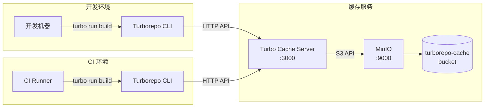

# Turborepo 远程缓存搭建指南

如果你的网络环境是公司局域网，并且你想在自己的服务器上搭建 **Turborepo 远程缓存**，**开箱即用的配置**是完全可以实现的。以下是详细步骤，适用于在本地开发机器、Linux 服务器或 Git 仓库中设置的场景。整个过程将依赖一个开源的 **remote cache server** 和支持的 **S3** 存储服务（如 MinIO）。

---

## 步骤 1：选择 Remote Cache 方案

最简洁的方案是使用 **Turbo Cache Server**，它是一个 Rust 实现的轻量级 HTTP 服务，专门用于和 **Turborepo** 配合使用。

### 推荐的方案

- **Turbo Cache Server**：使用 Rust 实现的 `turbo-cache-server`，支持 S3 兼容存储，且高效。这个方案适合内网环境，开箱即用，并且部署简单。

---

## 步骤 2：准备 S3 存储（MinIO）

由于公司局域网环境下你可能无法直接使用 Vercel 提供的远程缓存服务，**MinIO** 是一个完美的选择。它是一个开源的 S3 存储服务，可以在内网部署并提供和 AWS S3 兼容的接口。

### 安装 MinIO

1. 你可以直接在 Linux 服务器上安装 **MinIO**。以下命令是安装并运行 MinIO：

```bash
# 下载 MinIO 可执行文件
wget https://dl.min.io/server/minio/release/linux-amd64/minio

# 赋予可执行权限
chmod +x minio

# 启动 MinIO（指定存储目录为 /data）
./minio server /data
```

2. 启动后，MinIO 将运行在 `http://localhost:9000`，你可以通过浏览器访问 MinIO 的管理界面。

3. 通过浏览器访问 `http://localhost:9000`，你可以创建一个 bucket，假设你命名为 `turborepo-cache`。

---

## 步骤 3：部署 Turbo Cache Server

**Turbo Cache Server** 是一个 Rust 实现的应用，可以很方便地通过 Docker 部署。

### 使用 Docker 部署 Turbo Cache Server

1. 从 Docker Hub 拉取 `turbo-cache-server` 镜像：

```bash
docker pull ghcr.io/vercel/turbo-cache-server
```

2. 启动 Docker 容器，并传入相应的环境变量，连接到你之前部署的 MinIO 实例：

```bash
docker run -d \
  -e S3_BUCKET_NAME=turborepo-cache \
  -e S3_ENDPOINT=localhost:9000 \
  -e S3_ACCESS_KEY=your-access-key \
  -e S3_SECRET_KEY=your-secret-key \
  -e S3_REGION=us-east-1 \
  -e S3_USE_PATH_STYLE=true \
  -p 3000:3000 \
  ghcr.io/vercel/turbo-cache-server
```

**环境变量说明：**

| 变量 | 说明 |
|------|------|
| `S3_BUCKET_NAME` | 你在 MinIO 上创建的 bucket 名称，如 `turborepo-cache` |
| `S3_ENDPOINT` | MinIO 地址，假设运行在 `localhost:9000` |
| `S3_ACCESS_KEY` | MinIO 的 Access Key（通过 MinIO 管理界面生成） |
| `S3_SECRET_KEY` | MinIO 的 Secret Key（通过 MinIO 管理界面生成） |

这样，`Turbo Cache Server` 将运行在 `http://localhost:3000`，并连接到你的 MinIO 存储。

---

## 步骤 4：配置 Turborepo 客户端

在本地开发机器或 CI 机器上，需要配置 Turborepo 使其使用你搭建的远程缓存服务。

### 4.1 配置环境变量

在你的 **Turborepo 项目的根目录**下，配置 `.env` 文件：

```bash
TURBO_API=http://localhost:3000
TURBO_TEAM=your-team-name
TURBO_TOKEN=your-token
```

**变量说明：**

| 变量 | 说明 |
|------|------|
| `TURBO_API` | 远程缓存服务器地址，指向 `Turbo Cache Server` |
| `TURBO_TEAM` | 你的团队名称，可以是 GitHub 上的组织名称，或者自定义 |
| `TURBO_TOKEN` | 访问令牌，可以通过 `npx turbo login` 来获取 |

### 4.2 配置 turbo.json

在 **`turbo.json`** 文件中，确保你已经配置了 `cache` 和 `outputs`，让 Turborepo 使用缓存：

```json
{
  "pipeline": {
    "build": {
      "outputs": ["dist/**", "build/**"]
    },
    "typecheck": {
      "outputs": []
    }
  }
}
```

这里定义了 `build` 的缓存输出目录（如 `dist/` 和 `build/`），这会将这些目录缓存到远程存储中。

---

## 步骤 5：测试缓存是否生效

1. **第一次构建**：运行一次 `npx turbo run build` 或 `npx turbo run typecheck`，这时构建和类型检查会执行，同时结果会上传到远程缓存（MinIO）。

2. **第二次构建**：运行 `npx turbo run build` 或 `npx turbo run typecheck`，这时如果没有代码变化，Turborepo 会从缓存中读取构建结果，而不会再次执行构建任务。

你应该会看到输出中标明了缓存命中，例如：

```bash
packages/ui:build (cached)
packages/utils:build (cached)
apps/web:build (executed)
```

---

## 步骤 6：其他配置（可选）

### 配置 HTTPS 服务

如果你希望通过 HTTPS 访问远程缓存服务器，可以在 Nginx 或 Traefik 后面配置反向代理，确保内网请求可以通过 HTTPS 进行。

### 配置身份认证（安全性）

- 你可以通过设置 `TURBO_TOKEN` 来保护缓存 API，确保只有授权的用户或 CI 才能访问。
- 还可以考虑通过 IP 限制或更复杂的认证方式来保护你的 Turbo Cache Server。

---

## 总结

你已经搭建了一个本地/局域网内的 **Turborepo 远程缓存** 环境，使用了 MinIO 作为 S3 存储和 Turbo Cache Server 作为缓存服务器。

**这种方式的优点：**

- 适用于 **公司局域网** 环境，保证缓存的高效性与安全性
- 配置简单，依赖少，使用 Docker 就能快速部署
- 通过配置 `turbo.json` 和 `.env` 文件，你的开发机器和 CI 可以直接连接到这个远程缓存，享受缓存带来的构建加速

---

## 架构图



如果有其他具体需求，或者在配置过程中有任何问题，可以继续调整和优化配置。
